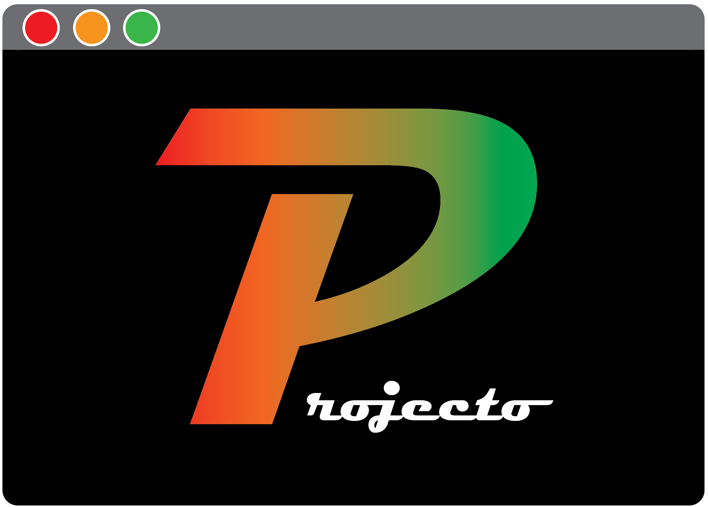

*Command line project management tool*

***v***: 0.0.0 (W.I.P.)

## Description
Projecto is a command line interface tool for managing hobby projects. Like a very simple and stripped back [Taskwarrior](https://github.com/GothenburgBitFactory/taskwarrior). 

## Installation

## Documentation
- [How to use projecto](docs/usage/howToUseProjecto.md)
- [Software Architecture Design](docs/design/architectureDesign.md)

