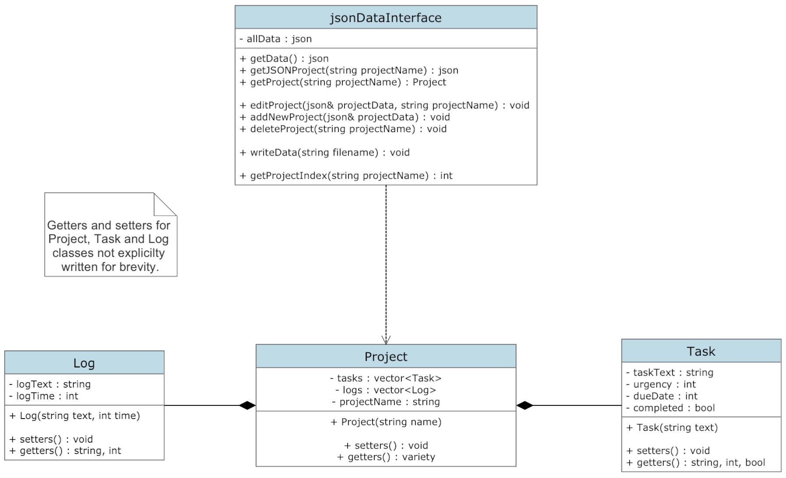
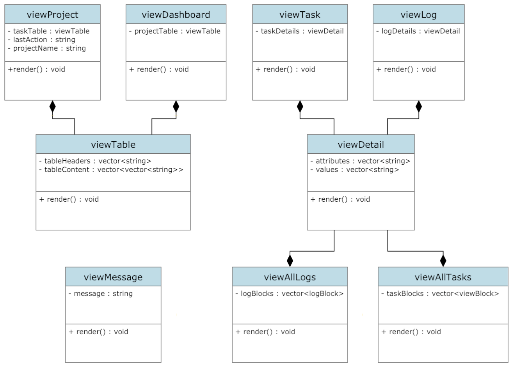
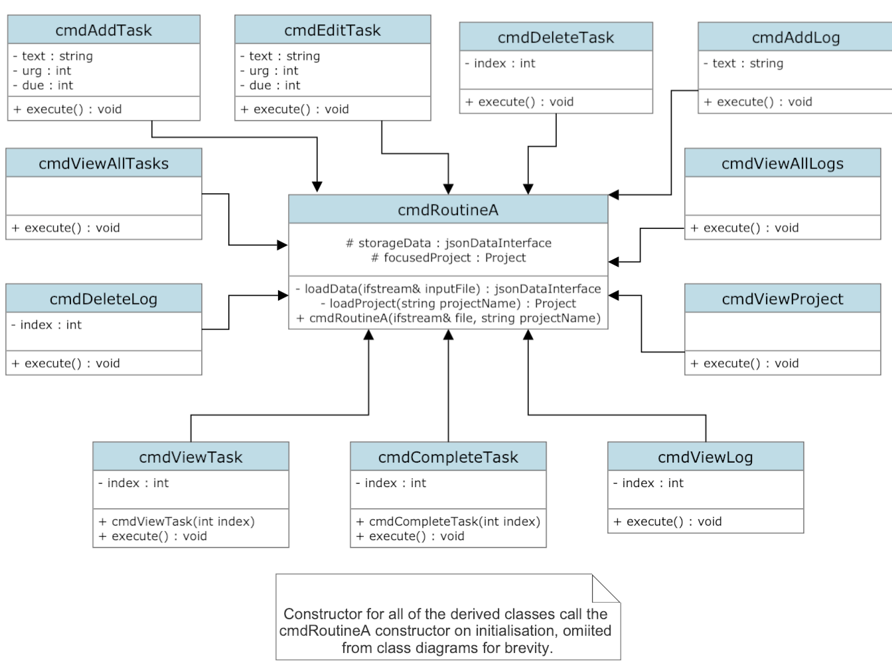
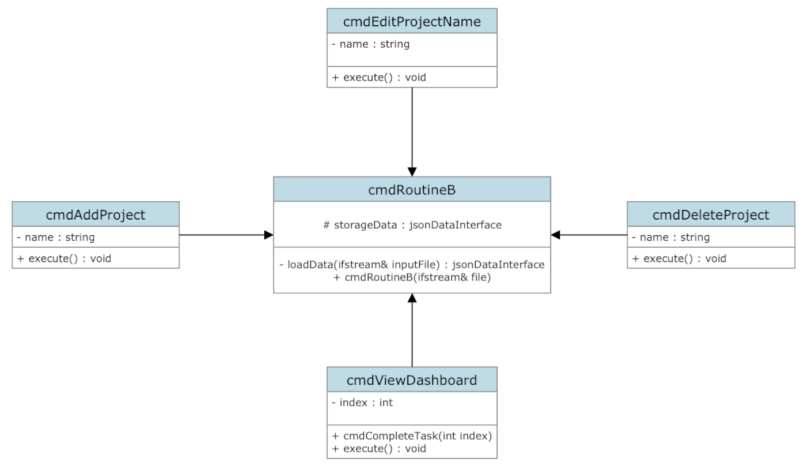
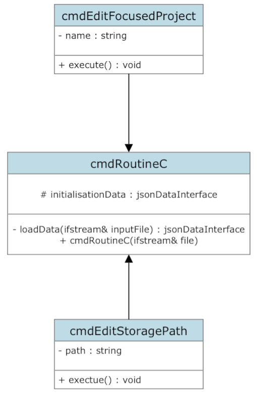

# Software Design
This document outlines the design of Projecto. The tense of the document varies at the moment due to writing up some parts of the design before and some parts after the code has been implemented. Once the release is finalised, this will be made consistent.

## Table of contents
---
- [User stories](#user-stories)
- [Design pattern](#design-pattern)
    - [Model + Data](#model-+-data)
    - [View](#view)
    - [Controller](#controller)
---
## User stories
Projecto aims to help manage hobby coding projects. Since I am designing this for personal use, the user stories will center around my need cases for now.

- I want to have an overview of my project that can show its tasks and a log of actions so that I can easily keep track of my coding exploits.
- I want to be able to quickly add, edit, delete and view tasks and quickly add, delete and view log entries (I feel that editing log entries serves no purpose for my envisioned use).
- I want to be able to store multiple projects and access them in such a manner that calling Projecto shows a specific project unless the focused project is changed (i.e., everytime projecto is called, it shows the same project it showed last time unless told otherwise) so that calling projecto is not unecessarily burdensome.
- I want the terminal output to be aesthetically pleasing so that I enjoy using the tool.
- I want to be able to easily extend the properties of tasks and log entries in the codebase in the future if so desired.

## Design pattern
Projecto is based on the MVC architectural design pattern. The *flavour* of MVC followed can be seen in the diagram below. The controller deals with user commands and then communicates with both the view and model appropriately. This decouples the view entirely from the model, making the system more robust and flexible. 

### Model + Data
A project needs to be able to have tasks and log entries (with the last log entry functioning as a **"last action"**). The model will therefore have project objects that act as containers of tasks and log entries.

To reduce the coupling of the project object to its aggregated objects, when editing one of them that corresponds to that project, it will be done by replacing the entire object. This way the project object does not care what the objects are, only that they exist.

Communication with the project object is therefore based entirely around adding, deleting, replacing or returning the tasks and log entries it stores. To get information about the specific aggregated objects, the objects own methods (getters) will be used.

The data will be stored in JSON format with the help of the [Nlohmann JSON](https://github.com/nlohmann/json) library. This library could have been used to construct the model too, but I chose to use a separate implementation in case I changed the data storage method in future.

There is a single simple data handling object `jsonDataInterface`. The principle of operation is that this object will load the data from the storage file, this data will be manipulated by the program and then rewritten to the data file using a `writeData()` method. This class is strongly coupled to the `Project` class as it can generate `Project` objects from JSON data. Changes to the `Project` class will necessarily require changes to this method in `jsonDataInterface`.

***Model + Data Class Diagram***

### View
There needs to be the following views in the project:

- All project overview: list of project names + the number of tasks for each project
- Individual project overview: list of project tasks and the last action of the project (the last log entry)
- Individual log view: view a single log entry
- Individual task view: full text of a task
- Full task view: full task text + completed tasks
- Full log view: view the entire log of the project
- Messages printed to the terminal after the success/failure of a command input

The view will be restricted to a max width of 80 characters per line (to match the 80 character/line code readability guide). ANSI sequences will be used for text formatting - this restricts the program to working only on terminals that support these sequences.

***Projecto View Class Diagram***

### Controller
The controller will take user inputs and transform them into model and view commands. Parsing and verification of user inputs will be done separately.

The commands of Projecto can be split into three categories which follow similar steps:

***Group A Commands Class Diagram***

***Group B Commands Class Diagram***

***Group C Commands Class Diagram***

