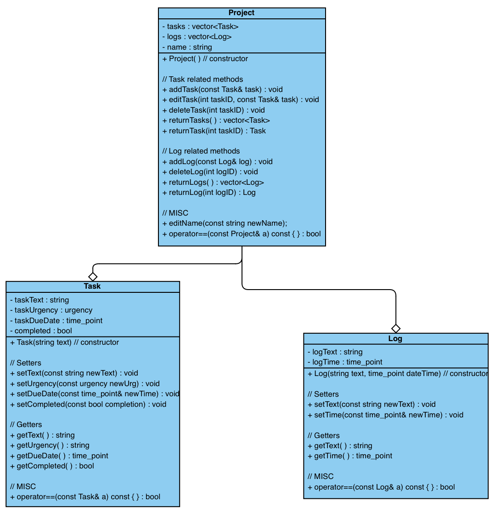

# Software Architecture Design
This project is built on the MVC architecture pattern. I chose this because it would help unit-testing, maintenance and future extensions. It also just makes sense for this type of application.

## Model
A project needs to be able to have tasks and log entries (with the last log entry functioning as a **"last action"**). The model will therefore have project objects that act as containers of tasks and log entries.

To reduce the coupling of the project object to its aggregated objects, when editing one of them that corresponds to that project, it will be done by replacing the entire object. This way the project object does not care what the objects are, only that they exist.

Communication with the project object is therefore based entirely around adding, deleting, replacing or returning the tasks and log entries it stores. To get information about the specific aggregated objects, the objects own methods (getters) will be used.

## View
There needs to be the following views in the project:

- All project overview: list of project names + the number of tasks for each project
- Individual project overview: list of project tasks and the last action of the project (the last log entry)
- Individual log view: view a single log entry
- Individual task view: full text of a task
- Full log view: view the entire log of the project
- Messages printed to the terminal after the success/failure of a command input

The view will be restricted to a max width of 80 characters per line (to match the 80 character/line code readability guide). ANSI sequences will be used for text formatting - this restricts the program to working only on terminals that support these sequences, in future I may shift to using a library such as [CPP Terminal](https://github.com/jupyter-xeus/cpp-terminal), but for now the terminals I will be using have full support for ANSI sequences.

> Note:
>
> The colour formatting could be made optional depending on whether the terminal supports it I think, I have seen something like this in the [Taskwarrior](https://github.com/GothenburgBitFactory/taskwarrior) source code.

The view will not interface directly with the model, but will take vector/string/int inputs and display them. The controller will be responsible for passing this data to the view when calling it.

## Controller
The controller will take user inputs and transform them into model and view commands. Controller code will contain the instructions for the model and view. Separate controller code will also be responsible for parsing command line arguments.

## Data Storage
The data will be stored in JSON format with the help of the [Nlohmann JSON](https://github.com/nlohmann/json) library. This library could have been used to construct the model too, but I chose to use a separate implementation in case I changed the data storage method in future.

There are two regular data handling objects:
1. jsonReader - handles reading the data file
2. jsonWriter - handles writing to the data file

There is also a third object will handle conversions to and from the models internal format and the json format necessary for storage.
3. jsonDataInterface
