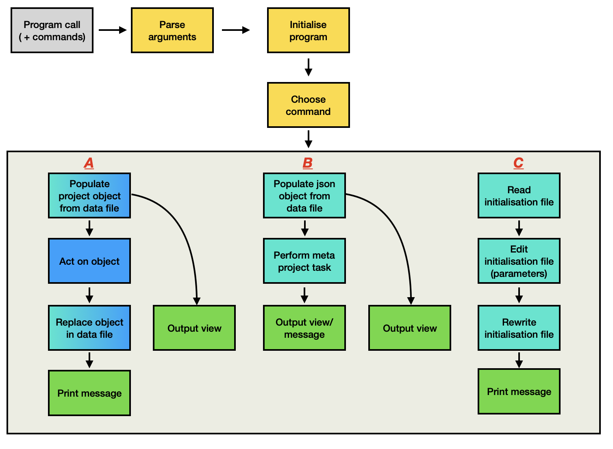

# Projecto Flow Diagram

---
*Diagram Key:* The boxes in the above diagram are colour-coded to roughly match what part of the architecture they fall under. This is an indicator of which part of the codebase these steps will call on.
- Grey box: initial program call
- Yellow boxes: controller
- Blue box: model 
- Teal boxes: data
- Blue/teal boxes: model
- Green boxes: view

> Note:
>
> The controller is responsible for handling the logic and instructions to go from one step to the next (shown by arrows in the diagram)
---

## Elaboration
When projecto is called, there are three common first steps.
1. Parsing the command line arguments, separating the command name and its modifiers
2. Initialising the program (setting the focused project and data file path)
3. Choosing the appropriate command

There are then three groupings of command type, A, B and C. These are grouped because they have similar steps to follow.

**Group A**:
The commands in this group are:
- Adding, editing, completing or deleting a task
- Adding or deleting a log entry
- Viewing project overview
- Viewing all project tasks
- Viewing all project logs
- Viewing individual project task
- Viewing individual project log

**Group B**:
The commands in this group are:
- Adding a new project
- Deleting an existing projectxs
- Changing the name of an existing project
- Viewing all projects overview

**Group C**:
The commands in this group are:
- Changing the data file storage path
- Changing the focused project

